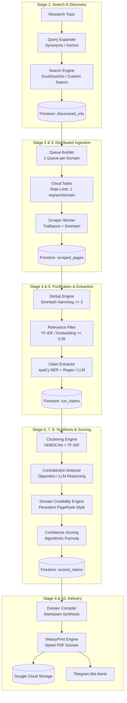

<div align="center">

# 🌐 Truth-Filtering Research Pipeline (v2)

**An autonomous, truth-corroborating intelligence pipeline designed to scrape up to 1,000,000 links, mathematically score facts, cross-examine contradictions, and compile textbook-grade research dossiers.**

[](https://github.com/Oladizz/oladizz-research/actions)
[](https://www.python.org/downloads/)
[](https://cloud.google.com/)
[](https://github.com/Oladizz/oladizz-research)
[](https://opensource.org/licenses/MIT)

[Architecture](#-architecture) • [Key Innovations](#-key-innovations) • [Stage Breakdown](#-pipeline-stages) • [Scoring Formula](#-confidence-scoring-engine) • [Quickstart](#-quickstart-guide)

</div>

---

## 📖 Overview

Standard web scrapers gather links; standard LLMs hallucinate summaries. **The Truth-Filtering Research Pipeline** bridges the gap: it operates as a decentralized fact-checking newsroom. 

You provide a topic (e.g., *"Quantum Computing Cryptography Benchmarks"* or *"Polymarket Trading Bots"*). The pipeline:
1. Expands search angles and crawls candidate URLs.
2. Deduplicates near-identical syndicate articles **before any AI is invoked**.
3. Isolates atomic, verifiable factual claims (numbers, percentages, dates, entities).
4. Groups claims across independent domains into mathematical clusters.
5. Cross-checks contradictory claims.
6. Calculates an algorithmic **Confidence Score** based on domain credibility and source independence.
7. Renders a publication-ready PDF textbook dossier and archives data to Google Cloud.

---

## ⚡ Key Innovations

### 1. 🛡️ 1 Worker Per Domain (Zero-Ban Rate Limiting)
Standard scrapers hammer sites with flat concurrency pools, triggering Cloudflare bans and 429 errors. Our pipeline groups URLs by domain before dispatching. Each domain queue enforces `max_concurrent_dispatches = 1`. Up to 100 workers scrape in parallel, but **never two workers on the same domain at the same time**.

### 2. 💸 Dual-Engine: Zero-AI ($0.00) or Model-Augmented
Run with **zero API costs** at any scale using pure Python engineering:
* **Query Expansion:** Template-based synonym permutations.
* **Extraction:** spaCy Named Entity Recognition (NER) + compiled regex heuristics.
* **Clustering:** TF-IDF sparse vectorization + HDBSCAN density clustering.
* **Contradiction Detection:** Grammatical directional opposites + conflicting numerical values.

*When budget is available, toggle `USE_AI_*=true` to augment any stage with Gemini 3.5 Flash-Lite, Gemini 3.7 Flash, Claude, or GPT-4o.*

### 3. 📈 Self-Learning Domain Credibility Engine
The pipeline maintains persistent domain reputation in Firestore. Domains that publish corroborated facts gain credibility over time; domains caught in unverified claims or contradicted data incur penalties.

### 4. 🔒 Built-in GCP Free-Tier Safeguards
Enforces hard discovery caps (e.g., `MAX_URLS_PER_RUN = 20000`) matching Google Cloud Firestore's daily free write limits, ensuring massive research runs cost **$0.00**.

---

## 🏗️ Architecture



---

## 🔬 Pipeline Stages

| Stage | Name | Technology | Description |
|---|---|---|---|
| **01** | **Search & Discovery** | Requests, BS4, DuckDuckGo | Expands topic into 10–15 diverse angles; normalizes and deduplicates URLs into Firestore. |
| **02** | **Queue Builder** | Cloud Tasks / Python Queues | Partitions URLs by domain; caps parallel domains at 100 with 1 task/domain concurrency. |
| **03** | **Scraper Worker** | Trafilatura, SimHash | Clean HTML to markdown; computes 64-bit SimHash content fingerprints; verifies robots.txt. |
| **04** | **Dedup & Relevance** | SimHash, TF-IDF / Vectors | Filters near-duplicate syndication (Hamming distance $\le 3$) and prunes irrelevant pages. |
| **05** | **Claim Extraction** | spaCy NER, Regex / Flash-Lite | Strips opinions, marketing, and fluff; isolates verified statements with entities and numbers. |
| **06** | **Clustering** | TF-IDF, HDBSCAN | Groups atomic claims into density clusters without O(n²) bottleneck. Identifies representatives. |
| **07** | **Contradiction Check**| String Logic / Gemini 3.7 | Analyzes conflicting figures, opposing directional terms, and contradictory assertions. |
| **08** | **Confidence Scoring**| Algorithmic Formula | Weighs verifiability tier, source count, credibility scores, and contradiction penalties. |
| **09** | **Dossier Synthesis** | WeasyPrint, Markdown | Generates executive summaries, badge-graded claims (🟢 $\ge 85\%$, 🟡 $\ge 60\%$), and citations. |
| **10** | **Delivery & Archival**| GCS, Telegram, BigQuery | Archives signed PDF to Cloud Storage, transmits alerts to Telegram, and exports trusted link tables. |

---

## 📐 Confidence Scoring Engine

The pipeline does **not** ask an AI *"how true does this feel?"* Truth is calculated deterministically:

$$\text{Confidence} = \text{Ceiling}_{\text{Tier}} \times f(N_{\text{sources}}) \times \bar{C}_{\text{domain}} \times (1 - P_{\text{contradiction}})$$

### 1. Verifiability Tiers ($\text{Ceiling}_{\text{Tier}}$)
* **Checkable Data ($100\%$ Max):** Claims containing hard figures, dates, wallet hashes, or percentages.
* **Corroboration ($80\%$ Max):** Non-numerical assertions confirmed by multiple independent outlets.
* **Anecdotal ($40\%$ Max):** Personal observations or subjective experiences.

### 2. Source Count Multiplier ($f(N)$)
Diminishing returns function ensuring independent confirmation increases trust:
$$f(N) = \min(1.0, 0.3 + 0.1 \times N_{\text{independent\_domains}})$$

### 3. Domain Credibility ($\bar{C}$)
Weighted average of the domain credibility scores:
* **Institutional (`.gov`, `.edu`, Reuters, AP):** $0.90 - 0.95$
* **Mainstream Press / Tech Journalism:** $0.70 - 0.85$
* **Unverified Blogs / Anonymous Platforms:** $0.30 - 0.50$
* **Content Farms / Known Scrapers:** $0.10$

### 4. Contradiction Penalty ($P_{\text{contradiction}}$)
Deducts $15\%$ per contradicting domain finding conflicting numbers or opposing claims.

---

## 🚀 Quickstart Guide

### Prerequisites
* Python 3.12+
* Linux / macOS / WSL

### 1. Local Installation
```bash
git clone https://github.com/Oladizz/oladizz-research.git
cd oladizz-research

# Install dependencies
pip install -r v2/requirements-dev.txt
python -m spacy download en_core_web_sm
```

### Option 1: 100% Free / Zero-AI Mode ($0.00, No API Keys, No GCP)
Run entirely on your laptop using DuckDuckGo, local spaCy NLP, and scikit-learn math:
```bash
python run_local_zero_ai.py "Autonomous AI Agent Frameworks 2026"
```
**What happens under the hood:**
1. Expands search queries using synonym templates.
2. Scrapes DuckDuckGo for top web articles.
3. Uses local spaCy NER to extract factual claims (percentages, figures, dates, entities).
4. Clusters identical facts across multiple websites using TF-IDF vector math.
5. Saves data to local SQLite database (`local_zero_ai.db`) and exports `local_zero_ai_report.md`.

---

### Option 2: AI-Powered Local PDF Mode (With Gemini API Key)
If you want Gemini 3.5 Flash-Lite to extract claims and compile a styled, magazine-grade PDF report locally:
```bash
# 1. Set your Gemini API Key
export GEMINI_API_KEY="your-gemini-api-key"

# 2. Run the local fallback app
python fallback_local_app.py "Best polymarket trading bots"
```
**Outputs generated:**
* `local_report.pdf` — Publication-quality WeasyPrint PDF with confidence scores.
* `trusted_links.txt` — Plaintext list of all corroborated source URLs.
* `local_research.db` — SQLite database storing raw claims and cosine clusters.

---

### Option 3: Run Live with Google Cloud Firestore & Cloud Storage
Authenticate your Google Cloud service account to run distributed stages against GCP:
```bash
export GOOGLE_APPLICATION_CREDENTIALS="path/to/your/gcp-key.json"
export GCP_PROJECT="litetrack-1783858226"
export RESEARCH_TOPIC="Next-Generation Solid State Batteries"
export RUN_ID="run-battery-001"

# Step 1: Discover URLs (writes to Firestore discovered_urls)
python v2/stage1_search/main.py

# Step 2: Scrape Pages in Batch (writes to Firestore scraped_pages)
export BATCH_MODE="true"
python v2/stage3_scraper/main.py

# Step 3: Deduplicate & Relevance Filter
python v2/stage4_dedup/main.py

# Step 4: Extract Factual Claims
python v2/stage5_extract/main.py

# Step 5: Cluster & Cross-Check Contradictions
python v2/stage6_cluster/main.py

# Step 6: Score Claims & Update Domain Credibility
python v2/stage7_scoring/main.py --run_id=$RUN_ID

# Step 7: Compile & Deliver PDF (Uploads to Cloud Storage bucket)
python v2/stage9_delivery/main.py --run_id=$RUN_ID --topic="$RESEARCH_TOPIC"
```

---

### Option 4: Run the Test Suite
Verify all 36 unit tests for scoring algorithms, SimHash, URL normalization, and clustering:
```bash
pytest v2/tests/ -v
```

---

## ⚙️ Configuration & Environment Variables

| Variable | Default | Purpose |
|---|---|---|
| `GCP_PROJECT` | `litetrack-1783858226` | Google Cloud Project ID |
| `GCP_REGION` | `us-central1` | Default GCP deployment region |
| `MAX_URLS_PER_RUN` | `20000` | Safety cap to guarantee Firestore Free-Tier protection |
| `USE_AI_QUERY_EXPANSION` | `false` | Set `true` to use Gemini for search queries |
| `USE_AI_EXTRACTION` | `false` | Set `true` to use Gemini 3.5 Flash-Lite for claim extraction |
| `USE_AI_CLUSTERING` | `false` | Set `true` to use Gemini 3.7 Flash for contradiction detection |
| `GEMINI_API_KEY` | `""` | Gemini API Key (Optional in Zero-AI mode) |
| `TELEGRAM_BOT_TOKEN` | `""` | Telegram bot token for instant report alerts |
| `TELEGRAM_CHAT_ID` | `""` | Telegram chat ID for delivery |

---

## 📁 Repository Structure

```tree
oladizz-research/
├── .github/
│   └── workflows/
│       ├── ci.yml                 # Automated pytest, ruff linting
│       └── deploy.yml             # Cloud Run & Workflows CI/CD
├── v2/
│   ├── config.py                  # Central configuration & thresholds
│   ├── models.py                  # Strongly typed Dataclasses
│   ├── deploy.sh                  # One-command GCP deployment script
│   ├── workflow.yaml              # Cloud Workflows orchestrator
│   ├── stage1_search/             # URL discovery & query expansion
│   ├── stage2_queue_builder/      # Cloud Tasks domain queue manager
│   ├── stage3_scraper/            # Trafilatura + SimHash web scraper
│   ├── stage4_dedup/              # SimHash Hamming & TF-IDF relevance
│   ├── stage5_extract/            # spaCy NER / Gemini claim extraction
│   ├── stage6_cluster/            # HDBSCAN clustering & contradiction detection
│   ├── stage7_scoring/            # Credibility engine & confidence scoring
│   ├── stage9_delivery/           # WeasyPrint PDF synthesis & GCS upload
│   ├── tests/                     # Comprehensive test suite (80%+ coverage)
│   └── utils/
│       ├── contradiction.py       # Directional opposites & rule-based checks
│       ├── cost_tracker.py        # Token & GCP resource expenditure tracking
│       ├── credibility.py         # WHOIS domain age & TLD heuristic engine
│       ├── hdbscan_cluster.py     # Density-based claim clustering
│       ├── logger.py              # Structured Cloud Logging integration
│       ├── lsh_dedup.py           # Locality Sensitive Hashing at scale
│       ├── query_expander.py      # Zero-AI template query generator
│       ├── robots.py              # Thread-safe robots.txt compliance
│       ├── secrets.py             # Secret Manager with env var fallback
│       ├── spacy_extractor.py     # Local rule-based fact extractor
│       └── tfidf_engine.py        # Scipy sparse matrix text vectorizer
├── gcp_setup.sh                   # One-time Google Cloud infrastructure setup
├── run_local_zero_ai.py           # Self-contained zero-cost local pipeline runner
└── README.md                      # Documentation
```

---

## 🧪 Testing

Run the test suite with coverage report:
```bash
pytest v2/tests/ -v --tb=short --cov=v2 --cov-report=term-missing
```

---

## 📄 License

Distributed under the MIT License. See `LICENSE` for more information.
